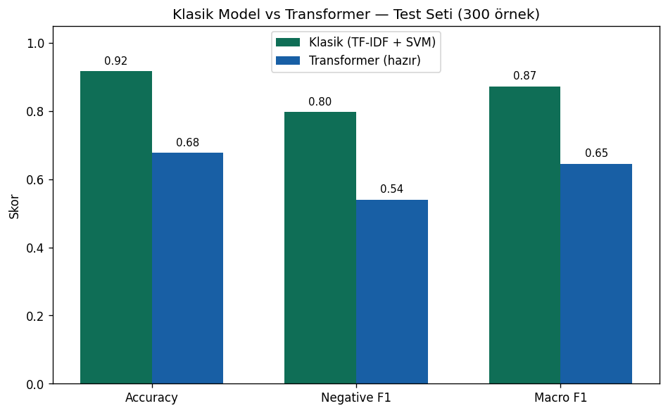

# Klasik NLP vs Transformer vs Fine-Tuning — Türkçe Duygu Analizi

Türkçe yorumlarda duygu analizini üç farklı yaklaşımla ele alan ve karşılaştıran
bir çalışma: klasik makine öğrenmesi (TF-IDF + Linear SVM), önceden eğitilmiş bir
transformer'ın hazır (out-of-the-box) kullanımı ve aynı transformer'ın bu veriyle
fine-tune edilmesi. Sayısal karşılaştırma, derinlemesine hata analizi ve fine-tuning
ile çözümü içerir.

## Kullanılan Araçlar
- Python, pandas, scikit-learn, matplotlib
- HuggingFace Transformers
- Hazır model: savasy/bert-base-turkish-sentiment-cased
- Fine-tune edilen base model: dbmdz/bert-base-turkish-cased
- Eğitim ortamı: Google Colab (T4 GPU)

## Veri Seti
- Kaynak: winvoker/turkish-sentiment-analysis-dataset (HuggingFace, CC-BY-SA)
- ~49.000 yorum; nötrler ayıklanıp ikili sınıflandırma için ~32.000 yoruma indirildi
- Sınıf dengesizliği: %82 olumlu, %18 olumsuz

## Yöntem (Üç Aşama)
1. **Klasik model:** TF-IDF + Linear SVM, bu veriyle eğitildi (class_weight="balanced")
2. **Hazır transformer:** Önceden eğitilmiş model out-of-the-box olarak kullanıldı
3. **Fine-tuning:** Base Türkçe BERT, bu veriyle Colab'da (T4 GPU) fine-tune edildi
Tüm modeller aynı eğitim/test bölmesiyle (random_state=42, stratify) karşılaştırıldı.

## Sonuçlar
| Model | Accuracy | Negative F1 | Macro F1 |
|---|---|---|---|
| Klasik (TF-IDF + SVM) | %92 | 0.80 | 0.87 |
| Transformer (out-of-box) | %68 | 0.54 | 0.65 |
| Transformer (fine-tuned) | %95 | 0.85 | 0.91 |




## Beklenmedik Bulgu ve Hata Analizi
Seçilmiş zor cümlelerde ("çok yavaş kargo" gibi) hazır transformer üstün göründü.
Ancak temsili test setinde, bu veriyle eğitilmiş klasik model belirgin şekilde öne geçti.

Hatalar incelendiğinde, hazır transformer'ın yanıldığı vakaların büyük kısmının aslında:
- Karışık yorumlar (hem övgü hem şikayet),
- Nötr/bilgilendirici cümleler,
- Tartışmalı şekilde etiketlenmiş örnekler
olduğu görüldü. Yani fark kısmen domain uyumsuzluğundan, kısmen de veri etiketlerinin
gürültüsünden kaynaklanıyor.

## Fine-Tuning ile Çözüm
Base Türkçe BERT (dbmdz/bert-base-turkish-cased) bu veriyle fine-tune edildiğinde hem
klasik modeli hem de kendi out-of-box halini geçti (%95). Ayrıca "çok yavaş kargo" ve
"ürün güzel ama kargo berbat" gibi bağlam gerektiren cümleleri de doğru sınıflandırdı —
üstelik aşırı özgüvenli değil, kalibre güven skorlarıyla (%95-99).

## Çıkarımlar
- Bir modelin zayıf görünmesi çoğu zaman modelin değil, göreve/veriye uyumun sorunudur.
- Önceden eğitilmiş model otomatik olarak daha iyi değildir; veriye uyum belirleyicidir.
- Gürültülü etikete karşı ölçülen accuracy, gürültüyü taklit etmeyi ödüllendirir.
- Seçilmiş örnekler yanıltıcıdır; temsili örneklemde ölçmek şarttır.
- Fine-tuning, güçlü bir önceden eğitilmiş modelin gerçek potansiyelini açar.

## Dosyalar
- `karsilastirma.py` — Klasik model vs hazır transformer karşılaştırması
- `fine_tuning.ipynb` — Fine-tuning notebook'u (Google Colab, T4 GPU)
- `uc_model_karsilastirma.png` — Üç yaklaşımın karşılaştırma grafiği

## Çalıştırmak için
```bash
pip install -r requirements.txt
python karsilastirma.py
```
Fine-tuning için `fine_tuning.ipynb` dosyasını Google Colab'da (GPU açık) çalıştırın.

---

# Classic NLP vs Transformer vs Fine-Tuning — Turkish Sentiment Analysis

A study comparing three approaches to sentiment analysis on Turkish reviews: classic
machine learning (TF-IDF + Linear SVM), an out-of-the-box pre-trained transformer, and
the same transformer fine-tuned on this data. Includes quantitative comparison, in-depth
error analysis, and a fine-tuning solution.

## Tools
- Python, pandas, scikit-learn, matplotlib
- HuggingFace Transformers
- Pre-trained model: savasy/bert-base-turkish-sentiment-cased
- Fine-tuned base model: dbmdz/bert-base-turkish-cased
- Training environment: Google Colab (T4 GPU)

## Dataset
- Source: winvoker/turkish-sentiment-analysis-dataset (HuggingFace, CC-BY-SA)
- ~49,000 reviews; neutrals removed, reduced to ~32,000 for binary classification
- Class imbalance: 82% positive, 18% negative

## Method (Three Stages)
1. **Classic model:** TF-IDF + Linear SVM trained on this data (class_weight="balanced")
2. **Out-of-box transformer:** Pre-trained model used as-is (zero-shot on this distribution)
3. **Fine-tuning:** Base Turkish BERT fine-tuned on this data in Colab (T4 GPU)
All models compared on the same train/test split (random_state=42, stratify).

## Results
| Model | Accuracy | Negative F1 | Macro F1 |
|---|---|---|---|
| Classic (TF-IDF + SVM) | 92% | 0.80 | 0.87 |
| Transformer (out-of-box) | 68% | 0.54 | 0.65 |
| Transformer (fine-tuned) | 95% | 0.85 | 0.91 |


## Surprising Finding & Error Analysis
On curated hard sentences (e.g., "çok yavaş kargo" / "slow shipping"), the out-of-box
transformer appeared superior. However, on a representative test set, the classic model
trained on this data clearly won.

Inspecting the errors revealed that most of the out-of-box transformer's misclassifications
were actually mixed reviews (both praise and criticism), neutral/informational sentences,
or arguably mislabeled examples. The gap stems partly from domain mismatch and partly from
noisy data labels.

## Fine-Tuning Solution
When the base Turkish BERT (dbmdz/bert-base-turkish-cased) was fine-tuned on this data, it
surpassed both the classic model and its own out-of-the-box version (95%). It also correctly
classified context-dependent sentences like "çok yavaş kargo" and "ürün güzel ama kargo
berbat" — with calibrated (not overconfident) probabilities of 95-99%.

## Takeaways
- A model looking weak is usually a task/data alignment issue, not a model issue.
- A pre-trained model is not automatically better; alignment with the data matters.
- Accuracy measured against noisy labels rewards mimicking the noise.
- Cherry-picked examples are misleading; evaluate on a representative sample.
- Fine-tuning unlocks the true potential of a strong pre-trained model.

## Files
- `karsilastirma.py` — Classic model vs out-of-box transformer comparison
- `fine_tuning.ipynb` — Fine-tuning notebook (Google Colab, T4 GPU)
- `uc_model_karsilastirma.png` — Three-approach comparison chart

## How to run
```bash
pip install -r requirements.txt
python karsilastirma.py
```
For fine-tuning, run `fine_tuning.ipynb` in Google Colab (GPU enabled).